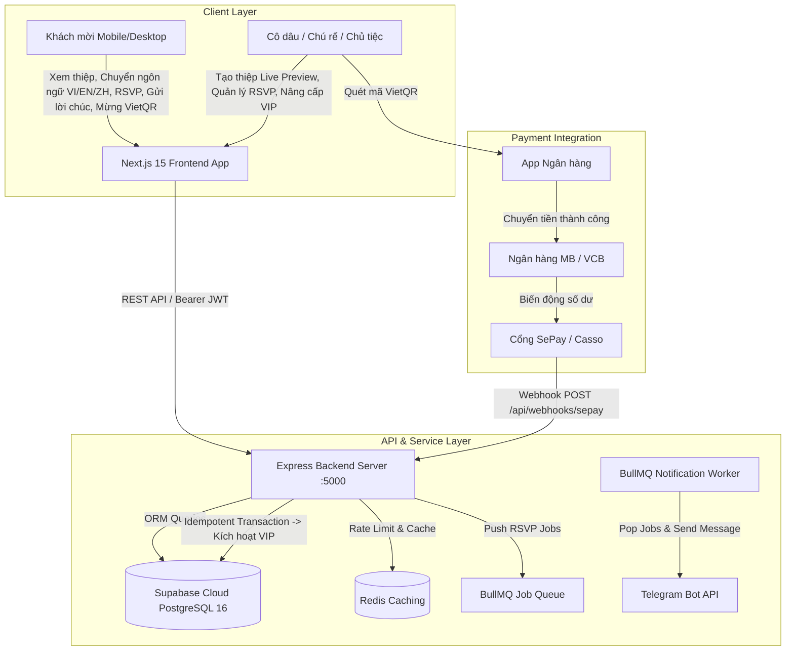
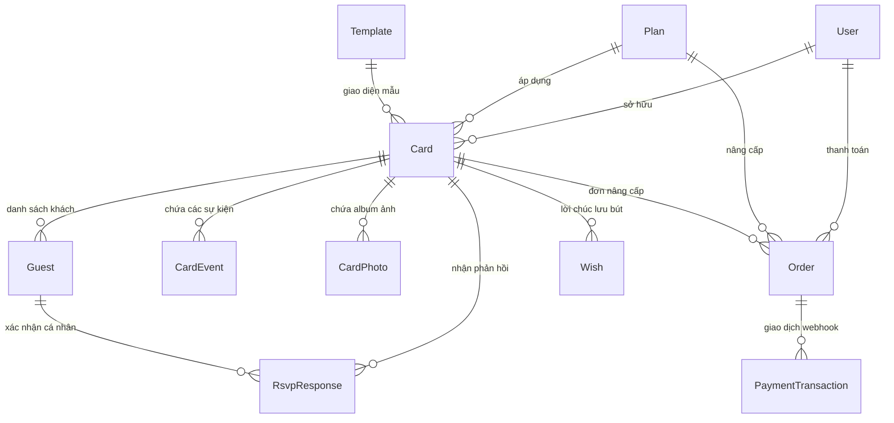

# DESIGN.md — TÀI LIỆU THIẾT KẾ HỆ THỐNG & UI/UX ARCHITECTURE
*Dự án: Nền tảng Thiệp Điện Tử Đa Danh Mục (Wedding / Birthday / Newborn Platform)*
*Hỗ trợ Đa Ngôn Ngữ: 🇻🇳 Tiếng Việt | 🇬🇧 English | 🇨🇳 中文*

---

## I. KIẾN TRÚC TỔNG THỂ HỆ THỐNG (SYSTEM ARCHITECTURE)



---

## II. THIẾT KẾ ĐA NGÔN NGỮ (I18N ARCHITECTURE)

Hệ thống hỗ trợ 3 ngôn ngữ với cơ chế chuyển đổi không tải lại trang (Zero Reload):
- 🇻🇳 **Tiếng Việt (`vi`)**: Mặc định cho người dùng trong nước.
- 🇬🇧 **Tiếng Anh (`en`)**: Dành cho khách mời quốc tế (*Save The Date, The Wedding Of, Accept with Pleasure...*).
- 🇨🇳 **Tiếng Trung (`zh`)**: Dành cho các gia đình người Hoa hoặc khách mời quốc tế (*婚礼喜帖, 喜结良缘, 准时出席...*).

### Cơ chế hoạt động:
- `LanguageProvider` (`fe/src/context/LanguageContext.tsx`) cung cấp hook `useLanguage()`.
- Component `LanguageSwitcher.tsx` nổi bật với icon cờ `🇻🇳 VI | 🇬🇧 EN | 🇨🇳 中文` cho phép khách chuyển đổi 1-chạm tức thì.
- Tự động lưu lựa chọn vào `localStorage.getItem("preferred_lang")`.

---

## III. THIẾT KẾ CƠ SỞ DỮ LIỆU (DATABASE ERD & MODELS)

Hệ thống bao gồm 10 thực thể cốt lõi trên Supabase Cloud:



---

## IV. THIẾT KẾ GIAO DIỆN & DESIGN SYSTEM (UI/UX TOKENS)

### 1. Bảng Màu Thiết Kế (Color Palette)
- **Tông Màu Cưới (Wedding Luxury):**
  - Màu chủ đạo: Vàng Hoàng Gia (`#D4AF37`), Xanh Pastel (`#8B9D83`), Hồng Phấn (`#FFC0CB`).
  - Nền trang: Trắng kem sang trọng (`#FAF8F5`), Giấy mỹ thuật (`#FDFBF7`).
- **Tông Màu Sinh Nhật (Birthday Vibrant):**
  - Màu chủ đạo: Cam Neon (`#FF5E36`), Vàng Ánh Kim (`#F59E0B`), Hồng Neon (`#EC4899`).
  - Nền trang: Đen huyền bí (`#0C0A09`), Xám than chì (`#1C1917`).
- **Tông Màu Thôi Nôi / Báo Hỷ (Newborn Sweet):**
  - Màu chủ đạo: Xanh Baby Blue (`#70A1FF`), Hồng Thiên Thần (`#FFB8B8`), Vàng Mơ (`#FEF08A`).
  - Nền trang: Xanh nhạt tinh khiết (`#F0F7FF`), Trắng mây (`#FFFFFF`).

### 2. Typography
- **Tiêu Đề:** `Playfair Display`, `Great Vibes` (Font Serif lãng mạn, thanh lịch).
- **Nội Dung:** `Inter`, `Plus Jakarta Sans` (Font Sans-serif hiện đại, rõ nét trên Mobile).
- **Thôi Nôi / Sinh Nhật:** `Quicksand`, `Outfit` (Tròn trịa, ấm áp, thân thiện).

---

## V. CẤU TRÚC COMPONENT FRONTEND

```
fe/src/components/
├── shared/                                 # CÁC COMPONENT DÙNG CHUNG
│   ├── LanguageSwitcher.tsx                # Nút chuyển ngôn ngữ VI / EN / ZH
│   ├── OpeningEffect/WaxSealOpening.tsx    # Phong bì sáp nến 3D (Đa ngôn ngữ)
│   ├── FallingEffect/index.tsx             # Cánh hoa, Tuyết, Trái tim, Bóng bay
│   ├── AudioPlayer.tsx                     # Trình phát nhạc Howler.js floating
│   ├── CountdownTimer.tsx                  # Đếm ngược + Nút Add Google Calendar
│   ├── GiftQrBoxModal.tsx                  # Popup VietQR (Tab Chú Rể / Cô Dâu)
│   ├── RsvpFormModal.tsx                   # Form xác nhận tham dự đa ngôn ngữ
│   └── GuestbookSection.tsx                # Sổ lưu bút & Lời chúc
│
├── wedding/WeddingView.tsx                 # VIEW THIỆP CƯỚI
├── birthday/BirthdayView.tsx               # VIEW THIỆP SINH NHẬT
└── newborn/
    ├── NewbornView.tsx                     # VIEW THIỆP THÔI NÔI (2 nhánh)
    └── BocDoGame.tsx                       # MINI-GAME BỐC ĐỒ VẬT THÔI NÔI (VI / EN / ZH)
```
