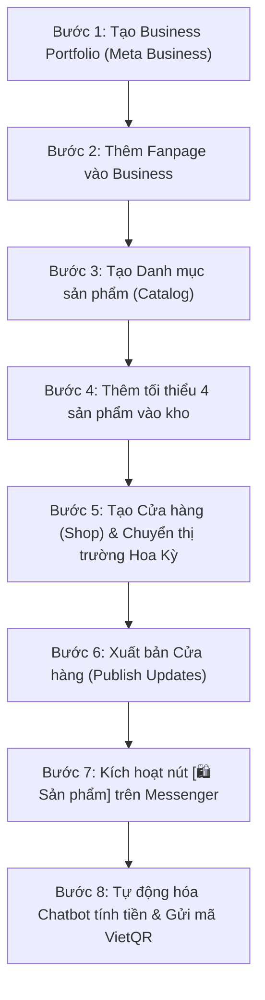

# HƯỚNG DẪN TOÀN DIỆN: THIẾT LẬP SHOP & NÚT SẢN PHẨM TRÊN MESSENGER (CHUẨN NHƯ SHOP MACI)

> **Mục tiêu:** 
> - Có nút ghim **`[ 🛍️ Sản phẩm ]`** ngay trong khung chat Messenger của Fanpage.
> - Bấm vào bung giao diện Native của Meta: xem lưới **"Tất cả sản phẩm"** và pop-up **"Chi tiết sản phẩm"** (ảnh lớn, giá, nút Đặt câu hỏi, Quan tâm, Mua ngay).
> - **100% MIỄN PHÍ:** KHÔNG cần giấy phép kinh doanh, KHÔNG cần website riêng, KHÔNG cần trả phí phần mềm.
> - Kết hợp Chatbot tự động tính tiền + gửi thông tin chuyển khoản kèm mã VietQR tự động.

---

## PHẦN 1: NHỮNG THỨ CẦN CHUẨN BỊ (CHECKLIST)

| STT | Thành phần | Chi tiết cần chuẩn bị | Ghi chú |
| :---: | :--- | :--- | :--- |
| **1** | **Fanpage Facebook** | Trang bán hàng bạn đang giữ quyền Quản trị viên (Admin). | Không phân biệt trang mới hay cũ (càng lâu năm càng uy tín). |
| **2** | **Tài khoản Facebook cá nhân** | Facebook chính chủ cầm quyền Admin trang. | Đã bật bảo mật 2 lớp (2FA). |
| **3** | **Danh sách sản phẩm mẫu** | Tối thiểu **4 sản phẩm** (ảnh, tên, giá bán, link Fanpage). | **Bắt buộc từ 4 sản phẩm trở lên** thì Facebook mới cho xuất bản Cửa hàng. |
| **4** | **Tài khoản nhận tiền** | Số tài khoản ngân hàng, Tên chủ tài khoản, Tên ngân hàng. | Dùng để bot tự sinh mã VietQR gửi cho khách chuyển khoản. |
| **5** | **Giấy phép kinh doanh?** | **HOÀN TOÀN KHÔNG CẦN** | Vì dùng hình thức chuyển khoản qua chat (Chuyển hướng), không dùng cổng thanh toán thẻ trực tiếp. |
| **6** | **Website riêng?** | **HOÀN TOÀN KHÔNG CẦN** | Dùng link Fanpage hoặc link chat `m.me` thay thế cho link website. |

---

## PHẦN 2: QUY TRÌNH THIẾT LẬP TỪNG BƯỚC (TỪ A ĐẾN Z)



---

### BƯỚC 1: Tạo Business Portfolio (Meta Business Suite)
1. Mở máy tính, đăng nhập Facebook Admin.
2. Truy cập: [https://business.facebook.com/overview](https://business.facebook.com/overview)
3. Bấm **"Tạo tài khoản"** -> Điền Tên doanh nghiệp (Ví dụ: `Shop Thời Trang`), Tên của bạn và Email của bạn.
4. Mở hộp thư email, bấm nút **"Xác nhận ngay"** từ Meta.

---

### BƯỚC 2: Thêm Fanpage vào Business Portfolio
1. Vào mục Cài đặt doanh nghiệp: [https://business.facebook.com/settings/pages](https://business.facebook.com/settings/pages)
2. Ở menu trái: chọn mục **Tài khoản** > **Trang**.
3. Bấm nút màu xanh **"Thêm"** > chọn **"Thêm Trang Facebook có sẵn"**.
4. Dán link hoặc tìm tên Fanpage của bạn -> Bấm **"Thêm Trang"** (Trang sẽ được duyệt ngay lập tức).

---

### BƯỚC 3: Tạo Danh mục sản phẩm (Catalog)
1. Truy cập: [https://business.facebook.com/commerce](https://business.facebook.com/commerce)
2. Chọn **Tạo danh mục mới** (hoặc vào [business.facebook.com/products/catalogs/new](https://business.facebook.com/products/catalogs/new)).
3. Chọn loại: **Sản phẩm online** (E-commerce).
4. Đặt tên danh mục: `Catalog_Products`.
5. Bấm **"Tiếp"** để hoàn tất tạo danh mục.

---

### BƯỚC 4: Thêm tối thiểu 4 sản phẩm vào kho (BẮT BUỘC)
> ⚠️ **ĐIỀU KIỆN QUYẾT ĐỊNH:** Meta yêu cầu tối thiểu **4 sản phẩm** mới cho phép mở Cửa hàng ra ngoài công khai.

1. Trong Công cụ quản lý thương mại, chọn: **Danh mục** > **Sản phẩm** > Bấm **"+ Thêm sản phẩm"** (Thêm thủ công).
2. Điền thông tin cho ít nhất 4 món đồ:
   - **Hình ảnh:** Tải ảnh sản phẩm vuông, rõ nét (tối thiểu 500x500px).
   - **Tiêu đề:** Tên sản phẩm (VD: *Chân Váy Đen Gân Giữa, Đầm Dự Tiệc Xòe, Áo Sơ Mi Lụa...*).
   - **Mô tả:** Mô tả chất liệu, kiểu dáng, size S/M/L.
   - **Liên kết trang web:** Dán link Fanpage hoặc link chat của bạn:  
     `https://www.facebook.com/profile.php?id=<ID_TRANG>` hoặc `https://m.me/<ID_TRANG>`.
   - **Giá cả:** Chọn tiền tệ **VND**, nhập số tiền (VD: `490000`).
3. Xóa các dòng trống thừa phía dưới -> Kéo xuống bấm nút **"Tải sản phẩm lên"**.
4. Đảm bảo các sản phẩm đều hiện trạng thái tích xanh: **🟢 Đủ điều kiện**.

---

### BƯỚC 5: Mở Cửa hàng (Shop) & Xử lý chặn vùng Việt Nam
1. Truy cập: [https://business.facebook.com/commerce_manager/onboarding/](https://business.facebook.com/commerce_manager/onboarding/)
2. Tại góc trên bên phải màn hình:
   - Ô **"Chọn thị trường chính của bạn"**: Đổi từ `Việt Nam 🇻🇳` sang **`Hợp chúng quốc Hoa Kỳ 🇺🇸`** (hoặc `Đài Loan`).
   - *(Bước này để Meta mở khóa nút "Tạo cửa hàng", không bị báo lỗi "Tính năng chưa dùng được tại quốc gia của bạn")*.
3. Bấm nút màu xanh: **"Tạo cửa hàng"**.
4. Chọn **"Tôi không sử dụng các nền tảng này"**.
5. Chọn Fanpage của bạn > Chọn Danh mục `Catalog_Products` > Điền email liên hệ > Tích đồng ý điều khoản > Bấm **"Gửi để xét duyệt"**.

---

### BƯỚC 6: Xuất bản Cửa hàng (Publish Updates) & Mở hiển thị
1. Ở menu bên trái, bấm vào mục: **"Cửa hàng"** (Shops).
2. Bấm nút màu xanh: **"Chỉnh sửa cửa hàng"** (Edit shop).
3. Nhìn xuống góc dưới cùng bên phải: bấm nút màu xanh đậm:  
   👉 **`Đăng bản cập nhật`** (Publish updates).
4. Sau khi đăng, quay lại Cửa hàng: kiểm tra dòng Fanpage chuyển từ trạng thái **"Ẩn"** sang **"Đang hoạt động / Hiển thị"**.

---

### BƯỚC 7: Kiểm tra nút `[ 🛍️ Sản phẩm ]` trên Messenger
1. Lấy một điện thoại khác (dùng **tài khoản Facebook khách hàng**, KHÔNG dùng tài khoản Admin).
2. Mở app **Messenger** -> Tìm Fanpage của bạn và bấm vào chat.
3. Nhắn 1 tin bất kỳ vào trang (VD: *"Shop ơi"*).
4. Nhìn góc dưới cùng bên trái (ngay cạnh ô nhập tin nhắn):
   - Nút **`[ 🛍️ Sản phẩm ]`** sẽ tự động hiển thị!
   - Bấm vào nút đó sẽ bung ra toàn màn hình danh sách sản phẩm và chi tiết sản phẩm chuẩn y hệt như shop MACI.

---

## PHẦN 3: TỰ ĐỘNG HÓA CHATBOT — TÍNH TIỀN & GỬI MÃ QR NGÂN HÀNG

Khi khách xem xong sản phẩm và muốn mua, làm thế nào để tự động chốt đơn mà không cần ngồi trực máy?

### Cách thức hoạt động:
Khách nhắn: *"Lấy cho mình 1 chân váy size M"* hoặc bấm nút *"Mua ngay"*:
1. Bot tự động xin: **Họ tên, Số điện thoại, Địa chỉ nhận hàng**.
2. Bot tự động tính **Tổng tiền** = (Giá sản phẩm x Số lượng) + Phí ship.
3. Bot tự động gửi tin nhắn tổng kết đơn hàng kèm **Ảnh mã QR VietQR chuẩn Napas247**.

### Công thức sinh mã QR ngân hàng tự động (Miễn phí 100%):
Bạn không cần tích hợp cổng thanh toán phức tạp. Chỉ cần dùng đường link ảnh VietQR mở:

```
https://img.vietqr.io/image/<MA_NGAN_HANG>-<SO_TAI_KHOAN>-compact2.png?amount=<SO_TIEN>&addInfo=<NOI_DUNG_CHUYEN_KHOAN>&accountName=<TEN_CHU_TK>
```

**Ví dụ thực tế:**
- Ngân hàng: MB Bank (`MB`)
- Số tài khoản: `0356577406`
- Tên chủ tài khoản: `TRAN HOAI BAO`
- Số tiền: `490000`
- Nội dung: `DH12345`

👉 **Đường link ảnh QR tạo ra tự động:**
`https://img.vietqr.io/image/MB-0356577406-compact2.png?amount=490000&addInfo=DH12345&accountName=TRAN%20HOAI%20BAO`

Khi bot gửi link ảnh này vào khung chat Messenger, khách hàng chỉ cần mở app ngân hàng bất kỳ (Vietcombank, MB, Techcombank, Momo...) quét mã là **tự động điền đúng STK, đúng tên và đúng số tiền**, không sợ khách chuyển nhầm!

---

## PHẦN 4: BẢNG TRA CỨU SỬA LỖI NHANH (TROUBLESHOOTING)

| Lỗi gặp phải | Nguyên nhân | Cách khắc phục |
| :--- | :--- | :--- |
| **Báo "Tính năng Cửa hàng chưa dùng được tại quốc gia của bạn"** | Để thị trường chính là Việt Nam. | Ở góc trên bên phải màn hình bắt đầu, đổi thị trường sang **Hoa Kỳ 🇺🇸** hoặc **Đài Loan**. |
| **Nút `[ Ẩn ▼ ]` bị mờ, không bật sang Hiển thị được** | Cửa hàng chưa đủ điều kiện tối thiểu hoặc chưa Publish. | 1. Thêm tối thiểu 4 sản phẩm vào Danh mục.<br>2. Vào "Chỉnh sửa cửa hàng" bấm "Đăng bản cập nhật". |
| **Đã làm xong hết nhưng Messenger của tôi không thấy nút Sản phẩm** | Đang dùng chính nick Admin để xem chat. | Nick Admin Facebook sẽ ưu tiên hiện giao diện Quản lý Hộp thư. Hãy dùng **nick Facebook khác (nick khách hàng)** để kiểm tra. |
| **Lỗi 121 khi kết nối Pancake / phần mềm bên ngoài** | Phần mềm đó bắt trả phí bản quyền hàng tháng. | Không cần dùng phần mềm trả phí. Dùng trực tiếp hệ thống Cửa hàng miễn phí của Facebook kết hợp kịch bản tự động hóa có sẵn. |

---

*Tài liệu được biên soạn phục vụ thiết lập vận hành bán hàng thời trang tự động trên Fanpage Meta & Messenger.*
