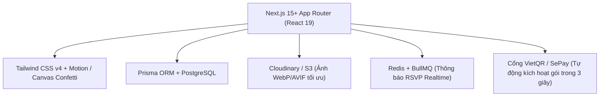

# BÁO CÁO PHÂN TÍCH TOÀN DIỆN NỀN TẢNG THIỆP CƯỚI ONLINE JUNVITE.COM
*Kèm đề xuất giải pháp kiến trúc & kế hoạch xây dựng website thiệp cưới online vượt trội*

---

## I. TỔNG QUAN VỀ JUNVITE.COM

- **Tên nền tảng:** Junvite (Slogan: *"Love, Beautifully Shared" / "Tạo thiệp cưới online miễn phí trong 10 phút"*).
- **Mô hình dịch vụ:** SaaS / Web-app cho thuê và tạo thiệp cưới điện tử (Digital Wedding Invitation & RSVP Management).
- **Thị trường mục tiêu:** Các cặp đôi trẻ (Gen Z, Millennials) tại Việt Nam chuẩn bị cưới, muốn tiết kiệm chi phí in thiệp giấy truyền thống, gửi link nhanh qua Zalo / Facebook Messenger / Telegram và quản lý số lượng khách tham dự thực tế.
- **Thống kê công bố:** Hơn 58.000+ thiệp được tạo, hơn 1.000.000+ lượt xem thiệp.

---

## II. CÁC TÍNH NĂNG CỐT LÕI (CORE FEATURES BREAKDOWN)

### 1. Trải nghiệm Khách Mời (Guest Experience)
1. **Hiệu ứng Mở phong bì & Con dấu sáp (Wax Seal Opening):**
   - Khi khách mở link thiệp, màn hình hiển thị một phong bì sang trọng với con dấu sáp khắc chữ lồng tên cô dâu & chú rể.
   - Khi bấm mở, hiệu ứng mở nắp phong bì và thiệp trượt ra kèm phát nhạc nền tự động.
2. **Nhạc nền cưới lãng mạn (Background Music Player):**
   - Nút bật/tắt nhạc nổi (floating sound toggle) ở góc màn hình.
   - Hỗ trợ chọn danh sách bài hát cưới hot trend hoặc tải file MP3 tùy chỉnh.
3. **Hiệu ứng thị giác tương tác (Falling Effects):**
   - Hiệu ứng cánh hoa rơi, trái tim bay, tuyết rơi hoặc pháo giấy (confetti) chạy nhẹ nhàng suốt trang.
4. **Thông tin Cô dâu - Chú rể & Lời ngỏ (Greeting & Couple Bio):**
   - Giới thiệu thông tin 2 bên gia đình (Nhà trai / Nhà gái), thông điệp cảm ơn và câu chuyện tình yêu (Love Story Timeline / Milestone).
5. **Đếm ngược thời gian (Live Countdown Timer):**
   - Hiển thị chính xác số ngày, giờ, phút, giây đến thời khắc diễn ra hôn lễ.
6. **Lịch trình sự kiện (Event Timeline & Schedule):**
   - Chi tiết: Lễ ăn hỏi / Lễ Vu Quy / Lễ Thành Hôn / Tiệc cưới nhà trai - nhà gái.
   - Tích hợp nút **"Thêm vào Google Calendar / Apple Calendar"** để khách không quên ngày.
7. **Bản đồ chỉ đường (Google Maps Integration):**
   - Nhúng bản đồ trực quan + Nút mở Google Maps dẫn đường trực tiếp tới nhà hàng/tư gia.
8. **Album ảnh cưới tương tác (Photo Gallery):**
   - Hỗ trợ nhiều kiểu hiển thị: Dạng lưới (Grid), Dạng lướt ngang (Carousel/Slider), Dạng ghép nghệ thuật hoặc 3D Flip Card.
   - Xem ảnh full-screen, phóng to vuốt mượt mà trên điện thoại.
9. **Xác nhận tham dự (RSVP Form):**
   - Khách nhập: Họ tên, số điện thoại, chọn *"Sẽ tham dự"* / *"Rất tiếc không thể đến"*, số người đi cùng (1, 2, 3+ người), lưu ý về món ăn hoặc phương tiện.
   - Dữ liệu gửi tức thì về trang quản lý của cô dâu chú rể.
10. **Hộp mừng cưới số (E-Gift Box / Mừng cưới QR Code):**
    - Modal popup hiển thị mã QR VietQR (tự động điền số tài khoản, tên ngân hàng, nội dung chúc mừng).
    - Chia làm 2 tab riêng biệt: *Mừng Chú Rể* và *Mừng Cô Dâu*.
    - Nút sao chép số tài khoản nhanh chỉ bằng 1 chạm.
11. **Sổ lưu bút & Lời chúc phúc (Guestbook / Wishes Wall):**
    - Khách gửi lời chúc trực tiếp lên thiệp, hiển thị danh sách lời chúc công khai kèm avatar/icon.

---

### 2. Trải nghiệm Cô dâu - Chú rể (Host / Creator Experience)
1. **Trình tạo thiệp trực quan (Visual Card Builder):**
   - Form nhập liệu thông minh chia theo từng bước:
     - Bước 1: Chọn mẫu thiết kế (Theme Selection).
     - Bước 2: Thông tin cặp đôi, ngày giờ, địa điểm tổ chức.
     - Bước 3: Tải ảnh cưới, chọn nhạc nền, cấu hình QR mừng cưới.
     - Bước 4: Xem trước (Live Mobile Preview) và xuất bản link.
2. **Cá nhân hóa Link thiệp cho từng khách (Personalized Guest Links):**
   - Tạo đường dẫn riêng kèm tên khách (Ví dụ: `junvite.com/thiep/quan-ha?to=Anh+Nam` -> Thiệp sẽ hiển thị: *"Trân trọng kính mời: Anh Nam"*).
3. **Bảng điều khiển Quản lý khách mời & Thống kê RSVP (RSVP Dashboard):**
   - Báo cáo tổng số khách được mời, số người xác nhận tham gia, số người vắng mặt, tổng số khẩu dự tiệc để gia đình chốt số lượng bàn tiệc chính xác.
   - Xuất danh sách khách ra file Excel.
4. **Hỗ trợ đa ngôn ngữ (Multi-language):**
   - Cho phép tạo thiệp song ngữ (Việt - Anh, Việt - Hàn, Việt - Trung...) phục vụ tiệc cưới quốc tế.

---

## III. PHÂN TÍCH ĐIỂM MẠNH & ĐIỂM HẠN CHẾ CỦA JUNVITE

### 1. Điểm mạnh (Pros)
- **Giao diện bắt mắt, hợp thị hiếu:** Thiết kế hiện đại, nhiều tông màu pastel, minimalist, sang trọng.
- **Tập trung mạnh vào Mobile Web:** 95% khách mở thiệp trên điện thoại thông qua Zalo/Messenger, thiệp responsive chuẩn tỉ lệ dọc (9:16) như một ứng dụng native.
- **Hiệu ứng cảm xúc tốt:** Phong bì sáp nến mở ra tạo cảm giác hồi hộp, trang trọng như nhận thiệp vật lý.
- **Dễ sử dụng:** Form tạo thiệp đơn giản, không đòi hỏi kiến thức kỹ thuật.

### 2. Điểm còn hạn chế & Cơ hội cải tiến (Cons & Opportunities)
- **Tốc độ tải ảnh chưa tối ưu cao:** Khi khách tải album nhiều ảnh phân giải cao, trang có hiện tượng giật nhẹ nếu mạng 4G yếu (Cần áp dụng CDN tối ưu ảnh dạng WebP/AVIF và Lazy-loading thế hệ mới).
- **Tùy biến bố cục còn cố định theo khung mẫu:** Khách khó đổi thứ tự các khối (ví dụ muốn đưa Lời chúc lên trước Album ảnh hoặc ẩn bớt 1 sự kiện).
- **Chưa có tự động thông báo RSVP qua Zalo ZNS / Telegram Bot:** Cô dâu chú rể phải đăng nhập web mới thấy ai vừa xác nhận đi.
- **Thanh toán tự động chưa tức thì:** Vẫn cần bước xác nhận hoặc duyệt thanh toán.

---

## IV. BẢNG GIÁ & MÔ HÌNH KINH DOANH THAM KHẢO

1. **Gói Miễn phí (Free):** Dùng thử tạo thiệp, giới hạn tính năng (gắn watermark nhỏ, giới hạn 5 ảnh, hết hạn sau 7 ngày).
2. **Gói Tiêu chuẩn (Basic - ~199.000đ):** Đầy đủ tính năng thiệp, lưu trữ 6 tháng, 15 ảnh, RSVP cơ bản, mã QR mừng cưới.
3. **Gói Cao cấp (VIP/Premium - ~399.000đ - 499.000đ):** Không giới hạn thời gian, hiệu ứng phong bì sáp nến độc quyền, đổi tên miền riêng (custom domain), xuất file Excel RSVP, gửi thông báo khách qua Zalo/Telegram.
4. **Dịch vụ gia tăng:** Thiết kế thiệp theo mẫu riêng độc bản (từ 999.000đ+), thiệp tốt nghiệp, thiệp sinh nhật/thôi nôi.

---

## V. ĐỀ XUẤT KIẾN TRÚC CÔNG NGHỆ ĐỂ XÂY DỰNG WEBSITE VƯỢT TRỘI

Để xây dựng một website thiệp cưới online mạnh mẽ, tải siêu nhanh và chuẩn SEO:

### 1. Công nghệ Frontend & UI/UX
- **Framework:** Next.js (App Router), React 19, TypeScript.
- **Styling & Animation:** Tailwind CSS v4, Framer Motion (hiệu ứng mở phong bì 3D, lật thiệp, trượt mượt mà), Canvas Confetti (pháo hoa/cánh hoa rơi siêu nhẹ không ngốn RAM điện thoại).
- **Audio Engine:** Howler.js (xử lý autoplay mượt mà khi người dùng tương tác mở thiệp).

### 2. Công nghệ Backend & Database
- **ORM & DB:** Prisma ORM + PostgreSQL (Lưu trữ Cặp đôi, Mẫu thiệp, Cấu hình giao diện, Lời chúc, Khách mời RSVP, Giao dịch).
- **Cache & Queue:** Redis + BullMQ (xử lý gửi thông báo RSVP, queue nén ảnh nền, webhook thanh toán).
- **Thanh toán:** Tích hợp SePay / Casso bắt biến động số dư ngân hàng qua mã QR VietQR -> Tự động mở khóa gói VIP ngay sau khi khách quét mã thanh toán 3 giây.

### 3. Các tính năng "Ăn điểm" vượt trội so với Junvite
1. **Bộ đếm RSVP Realtime + Bắn tin nhắn về Telegram/Zalo:** Mỗi khi có khách xác nhận tham dự hoặc gửi lời chúc, bot tự động bắn tin nhắn về điện thoại của cô dâu chú rể.
2. **Trình kéo thả tùy biến khối linh hoạt (Drag & Drop Block Builder):** Cho phép đảo vị trí Album ảnh, Bản đồ, Video Youtube/Tiktok cưới, Lời chúc tùy thích.
3. **Trình tạo ảnh thiệp mời (OG Image) động:** Tự động sinh ảnh thumbnail hiển thị trên Zalo/Facebook có tên cô dâu chú rể khi share link.
4. **Bộ sưu tập hiệu ứng mở thiệp đa dạng:** Ngoài phong bì sáp nến, có thêm: Cánh cổng hoa mở ra, Hộp quà mở nắp 3D, Phong cách thiệp báo vintage.

---

## VI. BƯỚC TIẾP THEO

File phân tích chi tiết đã được tạo tại thư mục dự án: `d:\freelancer\WebsiteThiep\PHAN_TICH_JUNVITE_VA_KE_HOACH_XAY_DUNG.md`.
Bạn có thể bắt đầu khởi tạo dự án với cấu trúc Next.js + Tailwind v4 + Prisma theo kế hoạch trên!
