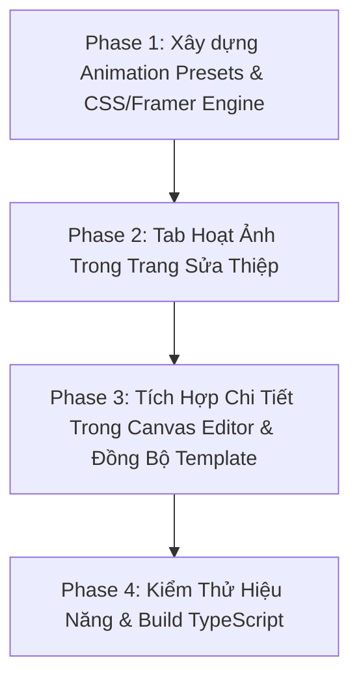

# Kế Hoạch Thiết Kế: Hệ Thống Tùy Biến Hoạt Ảnh Thành Phần Thiệp (Card Element Animations Studio)

> **Mã kế hoạch:** `2026-10-01-card-animation-and-effects-studio-plan.md`  
> **Áp dụng theo:** `planning`, `nextjs-frontend-best-practices`, `ui-design`, `react-advanced-patterns`  
> **Trạng thái:** Chờ duyệt (Proposal / Review)  
> **Tác giả:** Antigravity AI Assistant

---

## 1. Bản chất & Mục tiêu người dùng

Người dùng mong muốn: **Tùy biến hiệu ứng chuyển động (animations) cho từng THÀNH PHẦN (Elements & Sections) cụ thể bên trong thiệp cưới/thiệp online**, thay vì hiệu ứng hạt rơi nền.

Cụ thể gồm 2 cấp độ:
1. **Cấp độ Toàn Cục / Section (Trong trang Chỉnh Sửa Thiệp Form & Visual Editor):**
   - **Tên Cặp Đôi / Tiêu Đề:** Tùy chọn hiệu ứng chữ (Ánh kim lấp lánh `Shimmer`, Hiện từng từ `Kinetic`, Gõ máy chữ `Typewriter`, Trồi lên mềm mại `Slide Up`).
   - **Ảnh Cưới / Gallery:** Tùy chọn chuyển động ảnh (Phóng to chậm sống động `Ken Burns Living Photo`, Lơ lửng bồng bềnh `Floating Photo`, Phản chiếu vệt sáng `Gleam Sweep`, Lật thẻ 3D).
   - **Khung Lời Ngỏ & Sự Kiện:** Tùy chọn hoạt ảnh khối (Cuộn thư truyền thống mở ra `Scroll Unfurl`, Danh ngôn tình yêu thở nhẹ `Floating Quote`, Huy hiệu ngày giờ tỏa sáng `Auspicious Medallions`).
   - **Nhịp xuất hiện khi cuộn trang (Scroll In-View Motion):** Các khối nội dung lần lượt trồi lên theo nhịp (Staggered Fade Up) tạo cảm giác cực kỳ điện ảnh (Cinematic).

2. **Cấp độ Chi Tiết Từng Phần Tử (Canvas Visual Editor):**
   - Khi click vào bất kỳ phần tử nào trên Canvas (Chữ, Ảnh, Khung viền, Sticker, Icon):
     - **Hiệu ứng Xuất Hiện (In-Animation):** `fade-in`, `slide-up`, `slide-left`, `slide-right`, `zoom-in`, `bounce-in`, `flip-3d`, `shimmer`.
     - **Hiệu ứng Chuyển Động Lặp Lại (Loop Animation):** `pulse` (nhịp thở), `float` (lơ lửng), `swing` (lắc lư nhẹ), `glow` (tỏa sáng phát quang).
     - **Tùy chỉnh thời gian:** Độ trễ xuất hiện (Delay: 0s - 2s), Thời lượng chạy (Duration: 0.3s - 2s).

---

## 2. Thiết kế Kiến Trúc Dữ Liệu (Schema & Payload)

Để không cần sửa đổi cấu trúc bảng Database Postgres hay chạy migrate, ta lưu cấu hình hoạt ảnh thành phần vào `categoryData.elementAnimations` trên model `Card`, đồng thời tận dụng trường `animation` và `loopAnimation` đã có sẵn trên từng `CanvasElement`.

```typescript
// Cấu hình hoạt ảnh cấp độ Thiệp & Sections (Lưu trong card.categoryData.elementAnimations)
export interface CardElementAnimationsConfig {
  // 1. Hoạt ảnh Tên Cặp Đôi / Tiêu Đề Chính
  headerTitleMotion: "shimmer" | "kinetic" | "fade-up" | "zoom-gentle" | "none";
  
  // 2. Chuyển động của Ảnh cưới đại diện & Album ảnh
  photoMotion: "living-kenburns" | "float-gentle" | "gleam-shine" | "zoom-hover" | "static";
  
  // 3. Hiệu ứng xuất hiện các khối nội dung khi khách cuộn màn hình (Scroll Reveal)
  scrollRevealStyle: "staggered-fade-up" | "smooth-unfurl" | "scale-reveal" | "none";
  
  // 4. Khung Lời Ngỏ / Thông Điệp Tình Yêu
  quoteBoxStyle: "floating-glow" | "scroll-unfurl-scroll" | "classic-fade";
  
  // 5. Tùy chọn tối ưu hiệu năng
  reduceMotionOnMobile: boolean; // Giảm bớt chuyển động trên máy yếu để tránh giật lag
}

// Cấu hình hoạt ảnh chi tiết từng phần tử Canvas (Lưu trong canvas.elements[i])
export interface CanvasElementAnimationProperties {
  animation?: "none" | "fade-in" | "slide-up" | "slide-down" | "slide-left" | "slide-right" | "zoom-in" | "bounce-in" | "flip-x" | "shimmer-text";
  animationDelay?: number;     // giây (vd: 0.2s, 0.5s)
  animationDuration?: number;  // giây (vd: 0.6s, 1.2s)
  loopAnimation?: "none" | "float" | "pulse" | "swing" | "spin-slow" | "glow";
  loopDuration?: number;       // giây lặp (vd: 3s, 5s)
}
```

---

## 3. Thiết kế Giao Diện Người Dùng (UI/UX)

### 3.1. Thêm Tab Mới trong Trang Sửa Thiệp: `🎭 Hoạt Ảnh Thành Phần`
Trong [`dashboard/cards/[cardId]/edit/page.tsx`](file:///d:/freelancer/WebsiteThiep/fe/src/app/(dashboard)/dashboard/cards/[cardId]/edit/page.tsx), thêm 1 tab mới vào danh sách `EDIT_TABS`:
- **Icon:** `Sparkles` hoặc `Film`
- **Label:** `Hoạt Ảnh`

#### Giao diện bên trong Tab Hoạt Ảnh:
Gồm các nhóm trực quan với **nút thử chuyển động (Demo Preview Hover)**:
1. **Chuyển Động Tên & Tiêu Đề:**
   - 🌟 *Ánh Kim Quét Ngang (Shimmer Gold)* — Vệt sáng vàng lướt qua tên cô dâu chú rể lấp lánh quý tộc.
   - ✍️ *Hiện Từng Ký Tự (Kinetic Word-by-word)* — Từng chữ nhẹ nhàng nổi lên tự nhiên.
   - ⬆️ *Bay Lên Mềm Mại (Fade & Slide Up)* — Trang nhã, tinh tế.
   - ⭕ *Tĩnh (Không chuyển động)*.

2. **Chuyển Động Ảnh Cưới (Living Photo Studio):**
   - 🎬 *Ảnh Sống Điện Ảnh (Ken Burns Living)* — Ảnh phóng to siêu chậm và êm dịu, tạo cảm giác như thước phim điện ảnh.
   - 🎈 *Bồng Bềnh Tự Nhiên (Photo Float)* — Ảnh khẽ trôi nhấp nhô nhẹ nhàng.
   - ✨ *Vệt Sáng Phản Chiếu (Gleam Ray)* — Khi cuộn tới có ánh sáng quét qua bề mặt ảnh như gương kính pha lê.

3. **Phong Cách Xuất Hiện Khi Cuộn Trang (Scroll In-View):**
   - 🌊 *Gợn Sóng Nối Tiếp (Staggered Waterfall)* — Các thông tin, thiệp báo hỷ, lịch sự kiện lần lượt trồi lên cách nhau 0.15s.
   - 📜 *Mở Cuộn Thư Hoàng Gia (Royal Unfurl)* — Khung thư mở bung theo chiều dọc.
   - 💎 *Tối Giản Hiện Đại (Soft Fade)*.

### 3.2. Nâng cấp Bảng Điều Khiển Chi Tiết trong Canvas Visual Editor (`RightPanel.tsx`)
Khi người dùng chuyển sang chế độ thiết kế tự do Canvas và bấm chọn 1 Text / Ảnh / Sticker:
- Bổ sung bộ chọn **In-Animation** trực quan với preview icon.
- Slider kéo thời gian trễ **Animation Delay** (0s -> 2s) để người dùng tự do căn chỉnh: "Chữ này xuất hiện trước, chữ kia trồi lên sau".
- Bộ chọn **Loop Animation** (Nhấp nhô, Nhịp thở, Lắc lư, Tỏa hào quang).

---

## 4. Kế hoạch triển khai theo từng Phase



### Phase 1: Mở rộng Thư viện Hoạt Ảnh & Motion Engine
- Tận dụng `framer-motion` đã có trong dự án và mở rộng file [`fe/src/components/wedding/effects/MotionElements.tsx`](file:///d:/freelancer/WebsiteThiep/fe/src/components/wedding/effects/MotionElements.tsx).
- Định nghĩa các CSS keyframes và Framer Motion variants tiêu chuẩn:
  - `shimmer-text`
  - `kinetic-reveal`
  - `living-kenburns`
  - `staggered-children`
  - `photo-gleam`
  - `pulse-gentle`
  - `float-y`

### Phase 2: Thêm Tab `🎭 Hoạt Ảnh` vào Trang Chỉnh Sửa Thiệp
- Thêm tab `animations` vào `EDIT_TABS` trong [`cards/[cardId]/edit/page.tsx`](file:///d:/freelancer/WebsiteThiep/fe/src/app/(dashboard)/dashboard/cards/[cardId]/edit/page.tsx).
- Thiết kế giao diện chọn hiệu ứng với các Card Button minh họa sống động.
- Kết nối State của `categoryData.elementAnimations` với preview trực tiếp bên phải (đổi hiệu ứng là xem được ngay).

### Phase 3: Nâng cấp Animation Tool trong Canvas Editor (`RightPanel.tsx`)
- Hoàn thiện mục `expandMotion` và `expandLoopMotion` trong [`RightPanel.tsx`](file:///d:/freelancer/WebsiteThiep/fe/src/components/editor/RightPanel.tsx).
- Thêm thanh trượt Animation Delay (Độ trễ) và Duration (Thời gian).
- Áp dụng class / style animation thực tế vào `CanvasCardView.tsx` và `CenterCanvas.tsx` khi render các element.

### Phase 4: Đồng bộ các mẫu thiệp công khai (Templates) & Kiểm thử
- Cập nhật các template thiệp ([`Template01...` đến `Template09...`](file:///d:/freelancer/WebsiteThiep/fe/src/components/wedding/templates/)) để đọc cấu hình `elementAnimations` và áp dụng hiệu ứng chuyển động tương ứng cho Tên, Ảnh, Khung.
- Kiểm tra tính mượt mà trên mobile, chống giật lag với CSS GPU acceleration (`transform`, `will-change`).
- Chạy `npx tsc --noEmit` ở cả `fe` và `be` đảm bảo 100% không phát sinh lỗi kiểu dữ liệu.

---

## 5. Giá trị mang lại cho người dùng

1. **Thiệp cưới trở nên sống động & điện ảnh (Cinematic):** Không còn là những trang ảnh và chữ đứng im nhàm chán; từng dòng chữ, từng bức ảnh đều chuyển động uyển chuyển, quý phái.
2. **Toàn quyền cá nhân hóa:** Cặp đôi thích phong cách nhẹ nhàng có thể chọn `Fade & Living Kenburns`; cặp đôi thích sang trọng lộng lẫy có thể chọn `Shimmer Gold & Royal Unfurl`.
3. **Dễ dùng tối đa:** Chỉ cần 1 click chọn kiểu chuyển động mong muốn là toàn bộ thành phần trong thiệp tự động nhảy múa đồng bộ, không cần phải là chuyên gia đồ họa.
