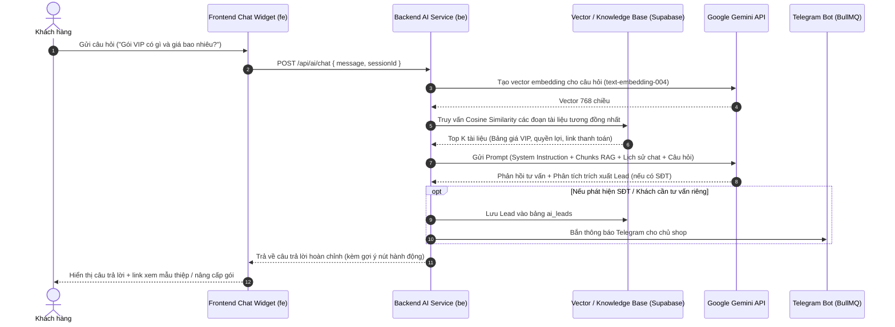

# THIẾT KẾ KỸ THUẬT: HỆ THỐNG AI RAG TỰ ĐỘNG TƯ VẤN KHÁCH HÀNG (WEBSITETHIEP)

- **Ngày tạo:** 2026-09-28
- **Trạng thái:** Chờ User phê duyệt (Brainstorming Phase)
- **Tech Stack:**
  - AI Engine: Google Gemini API (`gemini-1.5-flash` cho đàm thoại + `text-embedding-004` cho RAG Vector Search)
  - Backend: Node.js / Express + TypeScript + Prisma + Supabase PostgreSQL + Redis
  - Frontend: Next.js 15 App Router + React 19 + Tailwind CSS v4 + Framer Motion (Liquid Glass Theme)

---

## 1. MỤC TIÊU VÀ PHẠM VI NGHIỆP VỤ

1. **Tư vấn tự động 24/7 trên Website:** Khách hàng vào trang chủ hoặc trang xem thiệp có thể mở cửa sổ chat tư vấn với AI.
2. **RAG (Retrieval-Augmented Generation) thông minh:**
   - Truy xuất chính xác thông tin thực tế từ cơ sở dữ liệu và tài liệu của WebsiteThiep:
     - **Bảng giá:** Gói FREE (0đ), Gói BASIC (199.000đ trọn đời), Gói VIP (399.000đ trọn đời).
     - **Tính năng nổi bật:** Thiệp cưới online, đếm ngược, nhạc nền tự phát, bản đồ Google Maps, hộp mừng cưới quét mã VietQR động, sổ lưu bút điện tử, xác nhận tham dự (RSVP) gửi thông báo về Telegram.
     - **Mẫu thiệp cưới:** Giới thiệu mẫu thiệp có sẵn (Minimalist, Royal Gold, Floral Romantic, Vintage...) kèm link demo trực tiếp.
     - **Thanh toán:** Tự động qua SePay VietQR (kích hoạt gói ngay trong 3-5 giây sau khi chuyển khoản).
3. **Thu thập Lead (Khách hàng tiềm năng):**
   - Tự động nhận diện khi khách hàng để lại số điện thoại / Zalo / Email hoặc có nhu cầu làm mẫu thiệp thiết kế riêng.
   - Lưu thông tin Lead vào Database (`ai_leads`), thông báo ngay về Telegram Admin để nhân viên chốt sale kịp thời.

---

## 2. KIẾN TRÚC RAG & LUỒNG DỮ LIỆU



---

## 3. THIẾT KẾ CƠ SỞ DỮ LIỆU (DATABASE SCHEMA)

Thêm các model vào `be/prisma/schema.prisma`:

```prisma
// 1. Kho tri thức phục vụ RAG
model AiKnowledgeArticle {
  id          String   @id @default(cuid())
  category    String   // 'pricing' | 'features' | 'templates' | 'faq' | 'payment'
  title       String
  content     String   @db.Text
  tags        String[] // Tags từ khóa tìm kiếm nhanh
  embedding   Float[]  // Vector 768 chiều từ Gemini text-embedding-004
  metadata    Json?    // Thông tin bổ sung (link demo, button cta...)
  isActive    Boolean  @default(true)
  createdAt   DateTime @default(now())
  updatedAt   DateTime @updatedAt

  @@map("ai_knowledge_articles")
}

// 2. Phiên hội thoại & tin nhắn của khách
model AiChatSession {
  id          String         @id @default(cuid())
  sessionId   String         @unique // Mã phiên định danh client
  messages    AiChatMessage[]
  lead        AiLead?
  createdAt   DateTime       @default(now())
  updatedAt   DateTime       @updatedAt

  @@map("ai_chat_sessions")
}

model AiChatMessage {
  id        String        @id @default(cuid())
  sessionId String
  role      String        // 'user' | 'assistant' | 'system'
  content   String        @db.Text
  createdAt DateTime      @default(now())
  session   AiChatSession @relation(fields: [sessionId], references: [sessionId], onDelete: Cascade)

  @@index([sessionId])
  @@map("ai_chat_messages")
}

// 3. Khách hàng tiềm năng được AI chốt/xin thông tin
model AiLead {
  id            String        @id @default(cuid())
  sessionId     String        @unique
  customerName  String?
  customerPhone String?
  customerEmail String?
  demandNote    String?       @db.Text // Nhu cầu của khách (ví dụ: muốn làm thiệp cưới Vintage 500 khách)
  status        String        @default("NEW") // 'NEW' | 'CONTACTED' | 'CONVERTED'
  createdAt     DateTime      @default(now())
  updatedAt     DateTime      @updatedAt
  session       AiChatSession @relation(fields: [sessionId], references: [sessionId], onDelete: Cascade)

  @@index([customerPhone])
  @@map("ai_leads")
}
```

---

## 4. CHI TIẾT CÁC MODULE TRIỂN KHAI

### A. Backend (`be/`):
1. **Gemini Service (`be/src/services/gemini.service.ts`):**
   - Khởi tạo Google Gemini Client (`@google/genai` hoặc SDK tương đương).
   - Hàm `generateEmbedding(text: string): Promise<number[]>` dùng `text-embedding-004`.
   - Hàm `generateChatResponse(...)` dùng `gemini-1.5-flash` kèm temperature cân đối (0.3 - 0.5) tránh hallucination.
2. **RAG Knowledge Service (`be/src/services/rag.service.ts`):**
   - Tính toán Cosine Similarity giữa vector câu hỏi và vector kho tri thức.
   - Script Seed dữ liệu tri thức chuẩn (`be/prisma/seed_ai_knowledge.ts`) nạp sẵn dữ liệu thực tế về WebsiteThiep.
   - Lead Extraction Regex / Parser tự động trích xuất số điện thoại (0xxxxxxxxx / 84xxxxxxxxx).
3. **AI Controller & Route (`be/src/routes/ai.routes.ts`):**
   - `POST /api/ai/chat`: Nhận tin nhắn, thực hiện RAG, trả lời và lưu lịch sử.
   - `GET /api/ai/leads`: (Cho Admin) Xem danh sách SĐT khách hàng AI đã thu thập.
   - `POST /api/ai/knowledge/seed`: Tự động nạp vector cho các bài viết tri thức mẫu.

### B. Frontend (`fe/`):
1. **Floating AI Chat Widget (`fe/src/components/ai/AiConsultantWidget.tsx`):**
   - Nút nổi sang trọng ở góc dưới bên phải màn hình (đồng bộ phong cách Liquid Glass của website).
   - Bảng chat gồm:
     - Header: Avatar AI Consultant, trạng thái *"Online 24/7 - Sẵn sàng tư vấn"*, nút thu nhỏ/đóng.
     - Quick Prompt Pills: Các nút bấm câu hỏi mẫu nhanh ("Xem bảng giá", "Mẫu thiệp hot nhất", "Tư vấn làm thiệp theo yêu cầu").
     - Hộp thoại tin nhắn mượt mà (hỗ trợ render Markdown, đường link xem mẫu thiệp trực tiếp).
     - Hộp nhập tin nhắn kèm nút gửi sang trọng.
2. **Gắn Widget vào Layout chính (`fe/src/app/layout.tsx`):**
   - Hiển thị tự nhiên, không che lấp nội dung chính trên cả Mobile và Desktop.
